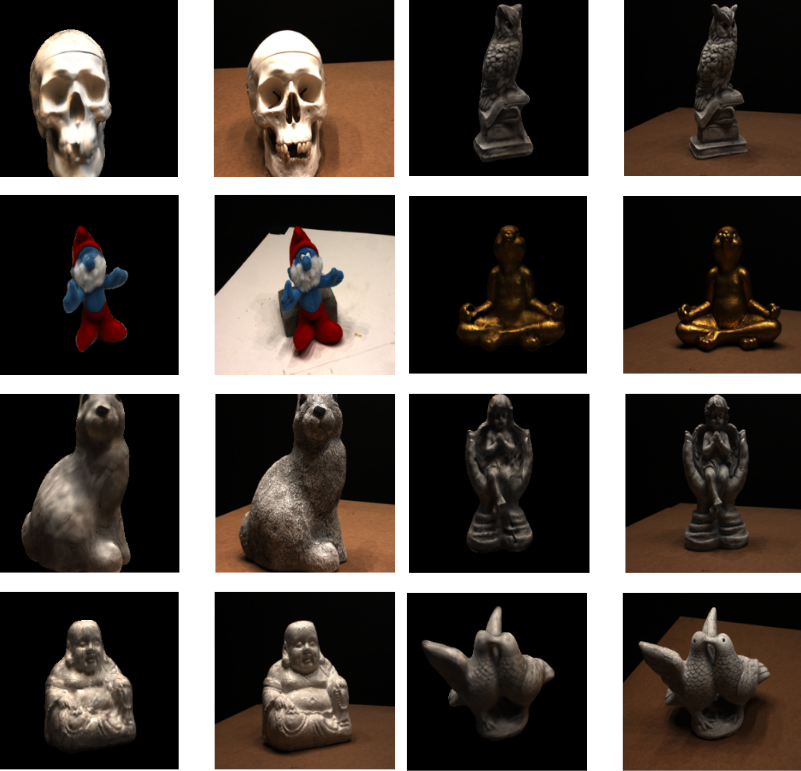
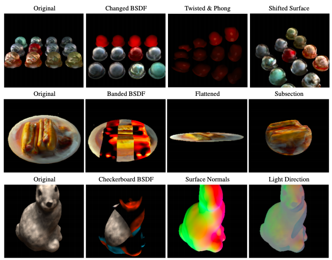

# Neural Raytracing

Raytracing is a rendering method that computes radiance along a ray projected into the scene. To this end, at the intersection of the ray with the scene, the  radiance emitted along the ray towards the camera is computed dependin on the reflectance and incoming radiance at the point. Conventional raytracing methods execute intersection and such lighting calculation efficiently, using parametric reflectance models and surface-based scene descriptions. We model these functions instead as neural nets, which allows us to gain flexibility and learnability for reconstruction as compared to traditional classical models. We
include learnable components for texture, lighting, and surfaces. These components augment a traditional raytracing pipeline, allowing for
learnability, but preserving other physically-based properties.

[Paper](http://arxiv.org/abs/2104.13562)

---

Original repository forked from [Pytorch3D](https://github.com/facebookresearch/pytorch3d),
and original readme [here](pytorch3d.md).

# What is Neural Raytracing?

`neural_raytracing` is an invertible raytracer implemented in Python/Pytorch, which allows for
learning components of the standard raytracing pipeline, given some ground truth. We use this to
approximate surfaces, lighting, and BSDFs, given some set of images.


- Example reconstructions from DTU dataset, with estimated lighting, textures, and objects. The
  1st and 3rd columns are the reconstructions, and the 2nd and 4th columns are the ground-truth
  images.

# Quickstart

### Setting up

In order to set up this repository, you _do not_ need to build Pytorch3D for most tasks. All we
use from Pytorch3d is their camera model for certain tasks, and only the components for building
the camera matrices.

The other main requirements are:
```
numpy
tqdm
pytorch
matplotlib
cv2
pillow
pytorch_mssim
```

Please leave a github issue if there is a problem setting up the repository.

### Running Code:

The various experiments in the paper are each implemented in a separate python script inside of
`$root_dir/scripts`.

```sh
python3 scripts/<script.py>
```

See the data folder for installation of each specific dataset.

If there is an issue running any script, or acquiring data, please leave an issue on the
repository.

## [Scripts](scripts/readme.md)

There are multiple scripts for reproducing our experiments, described below.
Parameters for them must be manually changed in the global variables at the top of each script.

- [colocate.py](scripts/colocate.py) will run our models on our own dataset of the bunny,
  buddha, and teapot.

- [nerfle.py](scripts/nerfle.py) will run both NeRF+PT and NeRF+LE on the bunny, buddha and
  teapot dataset.

- [dtu.py](scripts/dtu.py)/[dtu_vis.py](scripts/dtu_vis.py)/[edit_dtu.py](scripts/edit_dtu.py)
  will reconstruct some DTU scan with unknown lighting conditions, visualize it, and edit it,
  respectively.

- [nerf_synthetic.py](scripts/nerf_synthetic.py)/[test_nerf.py](scripts/test_nerf.py) will
  reconstruct a nerf synthetic dataset and compare it to the test set, respectively.


- Example edits done to reconstructed objects. 

#### Citation

```
@inproceedings{knodt2021neural,
  title={Neural Ray-Tracing: Learning Surfaces and Reflectance for Relighting and View Synthesis},
  author={Julian Knodt and Seung-Hwan Baek and Felix Heide},
  booktitle = {preprint},
  year={2021}
}
```

